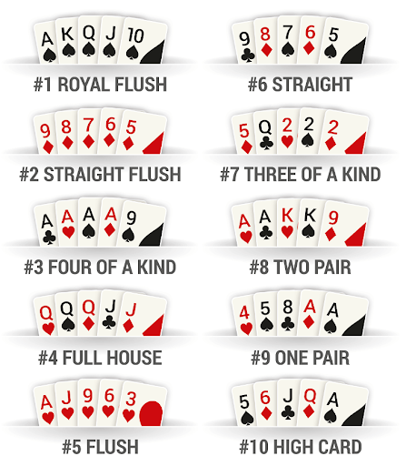
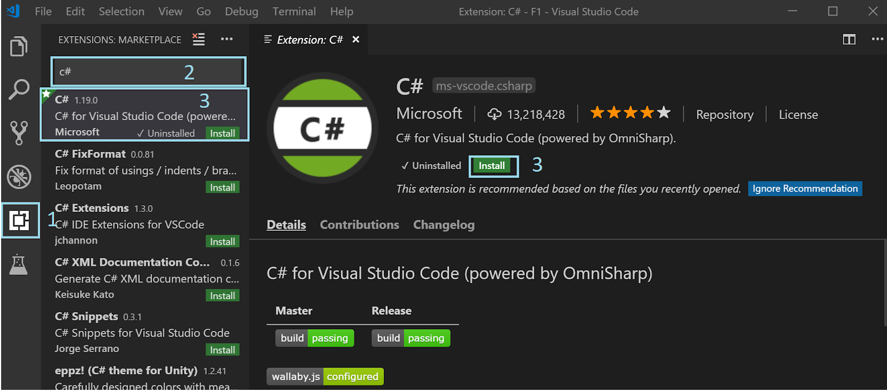

# Functional Programming C# Workshop
 

## Goals

- Score poker game
- Imperative programming
- Functional programming

## Anatomy Card

### Card Suits
-  Spades
-  Hearts
-  Diamonds
-  Clubs

### Card Values
- 2-10​
- Jack(11)​
- Queen(12)​
- King(13)​
- Ace(14)

### Hand Ranking


### Prerequisites
- VS Code (https://code.visualstudio.com/download)
- Net Core 2.2 (https://dotnet.microsoft.com/download)
- C# Extension


## 1. Create unit test

Create CardTest.cs file in Poker.Test
```
[Fact]
public void CanDescribeCard()
{
    var card = new Card(CardValue.Ace, CardSuit.Spades);

    Assert.Equal("Ace of Spades", card.ToString());
}
```

Add project reference to Poker.Test
Command:
```
dotnet add reference ../Poker.Library/Poker.Library.csproj
```
Add  the next files to Poker.Library
CardSuit.cs
```
public enum CardSuit
{
    Spades,
    Diamonds,
    Clubs,
    Hearts
}
```
 CardValue.cs

```
public enum CardValue
{
    Two = 2,
    Three,
    Four,
    Five,
    Six,
    Seven,
    Eight,
    Nine,
    Ten,
    Jack,
    Queen,
    King,
    Ace
}
```
Card.cs
```
public class Card
{
    public Card(CardValue value, CardSuit suit)
    {
        Value = value;
        Suit = suit;
    }

    public CardValue Value { get; set;}
    public CardSuit Suit { get; set;}
}
```
 

When this test passes, move on to the next exercise.


## 2. Create a Hand
Add HandTest.cs file to Poker.Test project

```
[Fact]
public void CanCreateHand()
{
    var hand = new Hand();
    Assert.True(hand.Cards.Count() == 0);
}

[Fact]
public void CanHandDrawCard()
{
    var card = new Card(CardValue.Ace, CardSuit.Spades);
    var hand = new Hand();

    hand.Draw(card);

    Assert.Equal(hand.Cards.First(), card);
}
```
Add Hand.cs file to Poker.Library
```
public class Hand
{
    public Hand()
    {
        Cards = new List<Card>();
    }
    public List<Card> Cards { get;}

    public void Draw(Card card)
    {
        Cards.Add(card);
    }
}
```
When this test passes, move on to the next exercise.

## 3. Hight Card
Add the next test:
```
[Fact]
public void CanGetHighCard()
{
    var hand = new Hand();
    hand.Draw(new Card(CardValue.Seven, CardSuit.Spades));
    hand.Draw(new Card(CardValue.Ten, CardSuit.Clubs));
    hand.Draw(new Card(CardValue.Five, CardSuit.Hearts));
    hand.Draw(new Card(CardValue.King, CardSuit.Hearts));
    hand.Draw(new Card(CardValue.Two, CardSuit.Hearts));
    Assert.Equal(CardValue.King, hand.HighCard().Value);
}
```
When this test passes, move on to the next exercise.
(Tip: if the collection is sort is easy)

## 4. Hand Rank
Add the HandRank enum to your project
```
public enum HandRank
{
    HighCard,
    Pair,
    TwoPair,
    ThreeOfAKind,
    Straight,
    Flush,
    FullHouse,
    FourOfAKind,
    StraightFlush,
    RoyalFlush
}
```
And add the next test to your HandTest file.
```
[Fact]
public void CanScoreHighCard()
{
    var hand = new Hand();
    hand.Draw(new Card(CardValue.Seven, CardSuit.Spades));
    hand.Draw(new Card(CardValue.Ten, CardSuit.Clubs));
    hand.Draw(new Card(CardValue.Five, CardSuit.Hearts));
    hand.Draw(new Card(CardValue.King, CardSuit.Hearts));
    hand.Draw(new Card(CardValue.Two, CardSuit.Hearts));
    Assert.Equal(HandRank.HighCard, hand.GetHandRank());
}

[Fact]
public void CanScoreFlush()
{
    var hand = new Hand();
    hand.Draw(new Card(CardValue.Two, CardSuit.Spades));
    hand.Draw(new Card(CardValue.Three, CardSuit.Spades));
    hand.Draw(new Card(CardValue.Ace, CardSuit.Spades));
    hand.Draw(new Card(CardValue.Five, CardSuit.Spades));
    hand.Draw(new Card(CardValue.Six, CardSuit.Spades));
    Assert.Equal(HandRank.Flush, hand.GetHandRank());
}
[Fact]
public void CanScoreRoyalFlush()
{
    var hand = new Hand();
    hand.Draw(new Card(CardValue.Ten, CardSuit.Spades));
    hand.Draw(new Card(CardValue.Jack, CardSuit.Spades));
    hand.Draw(new Card(CardValue.Queen, CardSuit.Spades));
    hand.Draw(new Card(CardValue.King, CardSuit.Spades));
    hand.Draw(new Card(CardValue.Ace, CardSuit.Spades));
    Assert.Equal(HandRank.RoyalFlush, hand.GetHandRank());
}
```
When this test passes, move on to the next exercise.

## 5. Hand Rank answers
## 6. Refactor
Card class
Hand class

## 7. Pairs
Add the next test to HandTest.cs.
```
[Fact]
public void CanScorePair()
{
    var hand = new Hand();
    hand.Draw(new Card(CardValue.Ten, CardSuit.Clubs));
    hand.Draw(new Card(CardValue.Jack, CardSuit.Spades));
    hand.Draw(new Card(CardValue.Nine, CardSuit.Spades));
    hand.Draw(new Card(CardValue.Ten, CardSuit.Hearts));
    hand.Draw(new Card(CardValue.Ace, CardSuit.Spades));
    Assert.Equal(HandRank.Pair, hand.GetHandRank());
}

[Fact]
public void CanScoreThreeOfAKind()
{
    var hand = new Hand();
    hand.Draw(new Card(CardValue.Ten, CardSuit.Clubs));
    hand.Draw(new Card(CardValue.Jack, CardSuit.Spades));
    hand.Draw(new Card(CardValue.Nine, CardSuit.Spades));
    hand.Draw(new Card(CardValue.Ten, CardSuit.Hearts));
    hand.Draw(new Card(CardValue.Ten, CardSuit.Spades));
    Assert.Equal(HandRank.ThreeOfAKind, hand.GetHandRank());
}

[Fact]
public void CanScoreFourOfAKind()
{
    var hand = new Hand();
    hand.Draw(new Card(CardValue.Ten, CardSuit.Clubs));
    hand.Draw(new Card(CardValue.Jack, CardSuit.Spades));
    hand.Draw(new Card(CardValue.Ten, CardSuit.Spades));
    hand.Draw(new Card(CardValue.Ten, CardSuit.Hearts));
    hand.Draw(new Card(CardValue.Ten, CardSuit.Spades));
    Assert.Equal(HandRank.FourOfAKind, hand.GetHandRank());
}

[Fact]
public void CanScoreFullHouse()
{
    var hand = new Hand();
    hand.Draw(new Card(CardValue.Ten, CardSuit.Clubs));
    hand.Draw(new Card(CardValue.Jack, CardSuit.Spades));
    hand.Draw(new Card(CardValue.Ten, CardSuit.Spades));
    hand.Draw(new Card(CardValue.Jack, CardSuit.Hearts));
    hand.Draw(new Card(CardValue.Ten, CardSuit.Spades));
    Assert.Equal(HandRank.FullHouse, hand.GetHandRank());

}
```
When this tests pass, move on to the next exercise.

## 8. Answers
## 9. Refactor

## 10. Straight
Add the next test to HandTest class
```
[Fact]
public void CanScoreStraight()
{
    var hand = new Hand();
    hand.Draw(new Card(CardValue.Ten, CardSuit.Clubs));
    hand.Draw(new Card(CardValue.Jack, CardSuit.Spades));
    hand.Draw(new Card(CardValue.Queen, CardSuit.Spades));
    hand.Draw(new Card(CardValue.King, CardSuit.Hearts));
    hand.Draw(new Card(CardValue.Ace, CardSuit.Spades));
    Assert.Equal(HandRank.Straight, hand.GetHandRank());
}
```
## 11. Straight answer
## 12. Refactor
## 13. Next steps add test for:
- Straight flush
- Two pairs


